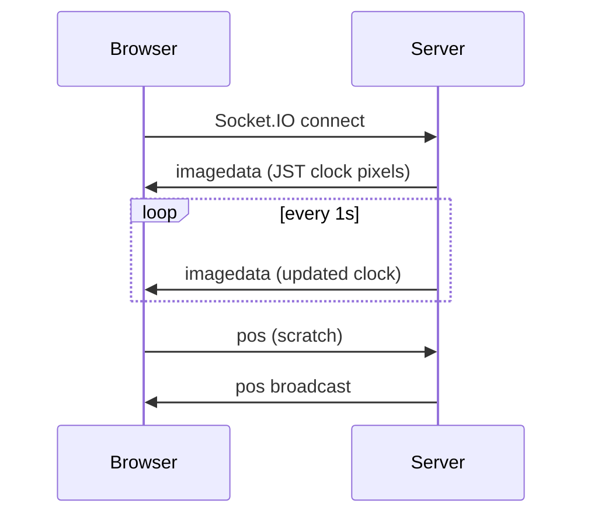

# hukitori

**こすったら見えるデジタルクロック** — グレーで隠れた現在時刻（JST）を、みんなでこすって表示していくリアルタイム Web アプリです。

1. みんなでコスるのを共有
2. こすったマスだけ時計が見える

## 起動

```bash
npm install
npm start
```

ブラウザで http://localhost:3001 を開きます（Cloud Agent ではポート転送が必要な場合があります）。

- デバッグ自動こすり: デフォルト **ON**（`?debug=0` で無効）
- 時刻は常に **JST**（`Asia/Tokyo`）

## 環境変数

| 変数 | 説明 | 既定 |
|------|------|------|
| `PORT` | HTTP ポート | `3001` |
| `TZ` | プロセス TZ（表示は `generate-image.js` 内で JST 固定） | 任意 |

## image.json の再生成

```bash
node -e "require('./server/generate-image').getImageData()"
```

`server/image.json` に現在の時刻ピクセルが書き出されます。

## アーキテクチャ



### Socket.IO イベント

| イベント | 方向 | 内容 |
|----------|------|------|
| `imagedata` | S→C | `{ text, pixels }` 時計の正データ |
| `pos` | C→S→C | `{ x, y }` こすり位置 |
| `hi` | S→C | 接続時の合図（レガシー） |

## テスト

```bash
npm test
```

## Reference

- WebSocket 入門: https://www.html5rocks.com/ja/tutorials/websockets/basics/
